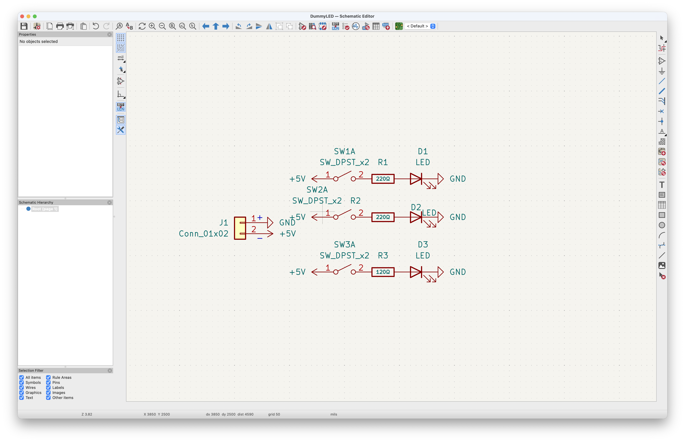
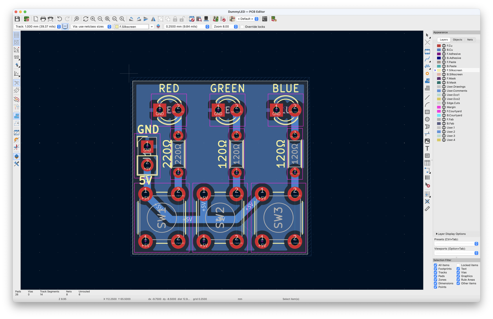

# DummyLED 🔴🟢🔵

**DummyLED** is a beginner-friendly PCB project designed to demonstrate basic circuit logic and tactile interaction. The board features three momentary buttons, each controlling a dedicated Red, Green, or Blue LED using a 5V power rail.

## Overview

The goal of this project is to create a physical interface where:

1. Pressing Button 1 lights up the Red LED.
2. Pressing Button 2 lights up the Green LED.
3. Pressing Button 3 lights up the Blue LED.

The circuit is designed for a 5V supply, providing enough voltage "headroom" to drive Green and Blue LEDs (which typically require $>3.0\text{V}$) at full brightness.

## Technical Specifications

**Circuit Logic**

The board uses a series configuration for each LED branch:

5V Rail -> Tactile Switch -> Current Limiting Resistor -> LED -> GND.

**Resistor Calculations**

To ensure consistent brightness across different colors, the following resistance values were calculated using Ohm's Law:

$$R = \frac{V_{source} - V_f}{I}$$

| Components | $V_f$ (Forward Voltage) | Resistor Value |
| :---------------: | :---------------: | :---------------: |
| **Red LED** | $~2.0V$ | **$220Ω$** |
| **Green LED** | $~3.2V$ | **$220Ω$** |
| **Blue LED** | $~3.2V$  | **$150Ω$** |

## Schematic & Layout

**Schematic**

**PCB Layout**

 

## License

This project is release under [MIT License](./LICENSE).
